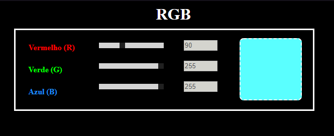
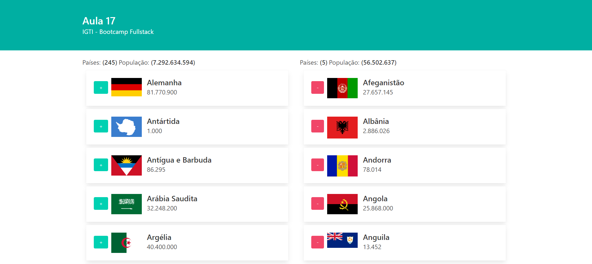
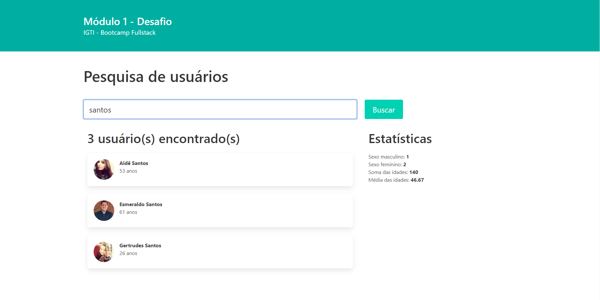

# IGTI - Bootcamp Desenvolvedor Fullstack

Repositório de projetos, atividades e desafios feitos durante o bootcamp.

#### Clique nas imagens para testar:

## Módulo1

### Prática

### Aula 17

### Desafio

